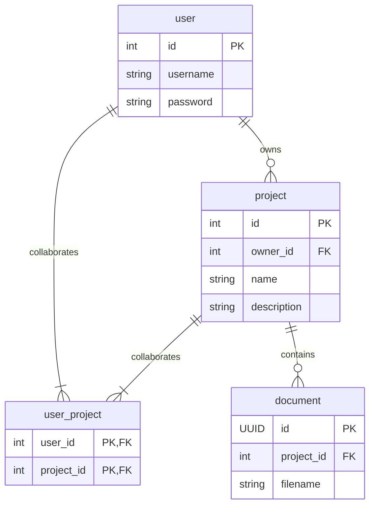

```mermaid
erDiagram
  user ||--o{ project: owns
  user ||--|{ user_project: collaborates
  user {
    int id PK
    string username
    string password
  }
  project ||--|{ user_project: collaborates
  project {
    int id PK
    int owner_id FK
    string name
    string description
  }
  user_project{
    int user_id PK, FK
    int project_id PK, FK
  }
  project ||--o{ document : contains
  document {
    UUID id PK
    int project_id FK
    string filename
  }
  
```
